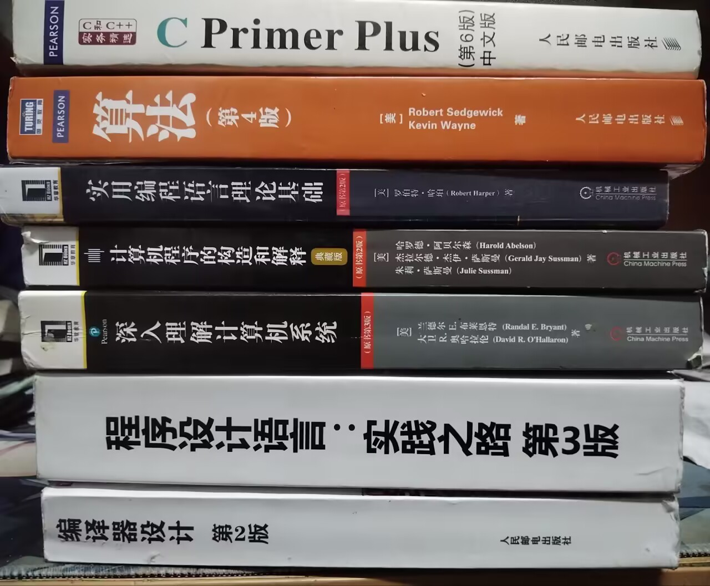
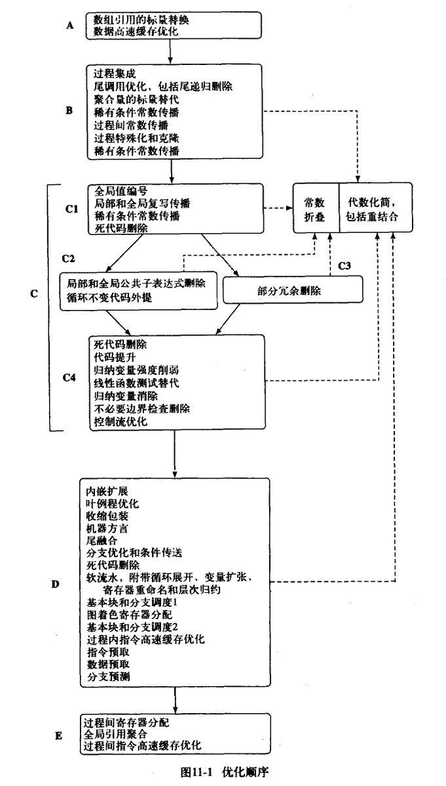
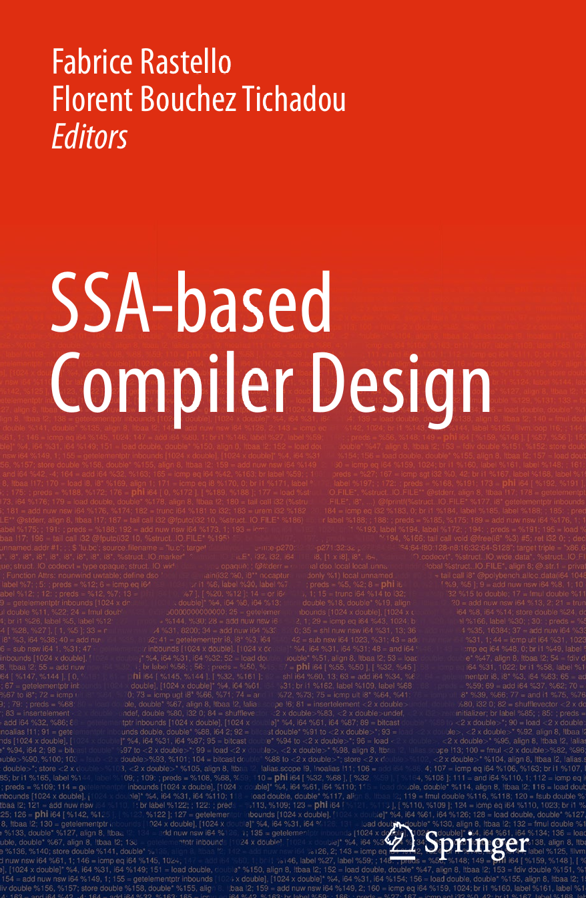

# 推荐的书单

我从初中一年级开始学编译原理，一开始没人带，**七年下来走了不少弯**，到现在也没学多少。目前国内对自己实现一门编程语言感兴趣的人不少，但大部分人都苦于没有一条明确的路径。

前几天有一位朋友问我，**如果想学习写编译器，有什么好的学习路径吗**？我虽然学得不深，但是好歹看了些书，在此推荐给大家。

另外欢迎加入我的群交流：[**670301108**](https://qm.qq.com/q/PjHZuzc8q6)

[点击链接加入群聊【Girls Band Compiler】：https://qm.qq.com/q/PjHZuzc8q6](https://qm.qq.com/q/PjHZuzc8q6)

放张我手边的书镇楼（混入了一些别的东西，但是是因为我有些书放家里了.. ）：

---

## 前置知识

在阅读编译原理相关的书籍之前，你需要对编程语言中的各种结构及其底层实现稍微有点认识。如果你不知道你是否了解，你可以去读 [《深入了解计算机系统 (CS: APP)》](https://book.douban.com/subject/26912767/) 和 [《计算机程序的构造和解释 (SICP)》](https://book.douban.com/subject/1148282/)，当然也可以边看编译原理边学！

---

## 书单

我想按重要程度分层介绍。有些同学虽然喜欢编译器，但是没有多少时间。因此，我按需要的时间排列了几个书单，短的书单只包含我认为最重要的那几本书！

### 书单 1 - 速成版！宝宝你是一个小蛋糕

只有看 **一本书** 的时间，看哪本呢？

#### 编译器设计 Engineering a Compiler

有些同学可能会提到“龙书”、“虎书”，毕竟这两本就是大部分学校用来上整个编译原理课的全部教材了... 

但是！我想推荐这本—— [**《编译器设计 (Engineering a Compiler, Second Edition)》**](https://book.douban.com/subject/20436488/) ，也称为“橡书”，我不知道为什么（逃

这本书的特点是**简洁而全面**，老实说我甚至不知道怎么把这么多内容塞到 500 页里的！

首先，它的脉络清晰，讲解的内容均衡、实用。它对编译器的前端（对代码的解析建模）、中后端（中间表示、优化等）都讲解得非常充分。相比之下，龙书就偏重于前端，其他部分一般。而虎书的全面性也不如这本书。

而且它的知识点是相当与时俱进的，比如 第 9 章 数据流分析 主要是结合 静态单赋值形式 (Static Single Assignment) 来讲解的，比起传统方法来说现代很多。

综上，我宣布 EAC 就是最好的入门书！只看一本也要看的书！

阅读顺序：

- 编译器设计 (Enginering a Compiler, Second Edition)

*一本书也要阅读顺序吗（逃*

### 书单 2 - 宝宝你是一个大蛋糕，好吃，爱吃！

这是一份 **三本书** 的版本！

首先，包含上面的 《编译器设计》 不用说。

#### 程序设计语言：实践之路 Programming Language Pragmatics

我想提到一点就是我认为 编程语言的设计与实现 不单纯是 写一个编译器 。因此我需要推荐 [**《程序设计语言：实践之路 (Programming Language Pragmatics, Third Edition)》**](https://book.douban.com/subject/10802357/) 。

其实这本书比教你写编译器的书更适合入门！

这本书并没有完整的教你写一个编译器的框架，而是详细地介绍了编程语言的一些核心概念：编程语言的种类、组成，**编程语言中常见的结构及其实现**，并详细考察了一些具体的编程语言。

通过阅读这本书，你能对运算、控制流、作用域、过程、类型、并发等编程语言中的基础概念的实质有深入的认识，并了解面向对象语言、函数式语言、逻辑式语言等范式的较为深层的结构。

#### 高级编译器设计与实现 Advanced Compiler Design and Implementation

然后再推荐一本编译优化的书，[**《高级编译器设计与实现 (Advanced Compiler Design and Implementation)》**](https://book.douban.com/subject/1400374/) 。

当年编译原理三幻神“龙虎鲸书”中唯一我想推荐的书，今天也非常不过时！当然它也是唯一不能直接读的书，这本书只关心编译优化，而完全不涉及前端词法/语法分析等等，因而它不适合作为初学教材。

它对典型编译优化算法的介绍非常系统、细致、全面，而且同时理论与实现都非常详细，结合紧密。

它的内容直接放张图吧！不仅清晰地列出了有哪些典型优化算法，而且全部详细介绍了！

学透了感觉直接去做编译器工程师也可以了。NVIDIA，你带我走吧！

阅读顺序：

- 程序设计语言：实践之路 (Programming Language Pragmatics, Third Edition)

- 编译器设计 (Enginering a Compiler, Second Edition)

- 高级编译器设计与实现 (Advanced Compiler Design and Implementation)

是的，你需要注意，**如果你有时间，并且决定阅读 PLP ，应该放在第一本书阅读，它作为入门书籍更好**，然后再阅读 EAC。然后你再阅读 ACDI。

### 书单 3 - 啊啊啊宝宝你是一个一个动了的资本的蛋糕啊啊啊！！

这是一份 **♾️ 本书** 的版本！

SVIP 套餐当然包含 VIP 套餐，上面的书都包括但不重复介绍了。到这里来说我假设你是想深入学习了，那书的数量就不限制了。

其实以上三本书学过，基础已经很牢固了，我再补充一些对编译器的某个阶段很有增益的书。

#### 垃圾回收算法的书书

你可能注意到 **C, C++** 这些语言和 **Java, Python** 不同，前者以手动内存管理为主，后者则依赖于自动垃圾收集。

如果你对编程语言的自动内存管理技术 (GC, Garbage Collection) 感兴趣，你可以阅读这两本中的一到两本：[**《垃圾回收的算法与实现》**](https://book.douban.com/subject/26821357/)，[**《垃圾回收算法手册：自动内存管理的艺术》**](https://book.douban.com/subject/26740958/) 。

其中，第一本非常通俗易懂地介绍了现在最常用的几种 GC 算法的性质与实现，讲得非常深入浅出，很容易理解！

而第二本则比较学术，介绍了包括第一本书介绍的 GC 算法。同时还讨论了一些 GC 实现中的进阶话题，比如内存屏障、运行时接口等等。

如果你只是想看看 GC 算法，你可以看看第一本书，如果你下定决心想深究 GC，可以直接看第二本书，理解不了再从第一本开始。

#### 现代体系结构的优化编译器 Optimizing Compilers for Modern Architectures

你可能注意到，在现代，体系架构的飞跃已经把传统默默串行啥也不优化的架构飞踢成路边一条了。在现代，编译器优化必须注意到流水线并行性，向量指令 (like SIMD)，异步处理器，超标量指令，VLIW 指令，存储层次结构管理，指令依赖分析等等等等等等一堆东西。

现在你该阅读 [**《现代体系结构的优化编译器 (Optimizing Compilers for Modern Architectures)》**](https://book.douban.com/subject/1171448/) 了！

当然它很难，我还没学到这呢！我先推给你吧，替我看！

#### SSA-based Compiler Design

我们已经知道了，静态单赋值形式是一种现代、利于分析和优化的中间表示形式。如何更有效地利用 SSA 构建编译器？这本书就是被称为 **The SSA Book** 的 SSA 圣经的出版版本。
[**《SSA-based Compiler Design (基于静态单赋值形式中间表示的编译器设计)》**](https://book.douban.com/subject/6870735/)

这本书是一个介于综述和论文集合之间的作品，形式比较独特，可以随意跳着读，拣取自己有兴趣的部分，找原论文仔细看。

我还没看完，但是我要推荐给你，因为我觉得这本书封面真的非常好看。

#### Parsing Techniques

你可能对编译器前端比较感兴趣，对各种解析算法感兴趣，而且不满足于主流的 LL, LR，想知道更多更强的解析奇技淫巧，那么你可以阅读 [**《Parsing Techniques (文本解析的技巧)》**](https://book.douban.com/subject/4291903/)

#### 其他有待补充

这份书单会一直更新，但是我今天就想到这些书，以后再补充吧！

阅读顺序：

- 程序设计语言：实践之路 (Programming Language Pragmatics, Third Edition)

- 编译器设计 (Enginering a Compiler, Second Edition)

- 高级编译器设计与实现 (Advanced Compiler Design and Implementation)

- 随便吧！哪本想看点哪里！你是一个成熟的编译人了

---

## 其他注意事项

另外欢迎加入我的群交流：[**670301108**](https://qm.qq.com/q/PjHZuzc8q6)

[点击链接加入群聊【Girls Band Compiler】：https://qm.qq.com/q/PjHZuzc8q6](https://qm.qq.com/q/PjHZuzc8q6)

如果你想用 Parser Generator 来生成前端，ANTLR v4 是最好的！你可以参考 [ANTLR 4权威指南 (The Definitive ANTLR 4 Reference)](https://book.douban.com/subject/27082372/)

---

## 本文参考的书单

感谢两位前辈的书单，我从中精选了一些，并增加了我自己喜欢的一些书籍。

- [RednaxelaFX: 学习编程语言与编译优化的一个书单](https://zhuanlan.zhihu.com/p/20130808)

- [陈乐群: 学习编译原理有什么好的书籍?](https://www.zhihu.com/question/315313590/answer/626705164)

同时推荐关注 RednaxelaFX 佬的知乎，虽然他已经不发了，但是他以前写的文章真的非常好！

---

**以上！MikanAffine 敬上！**
