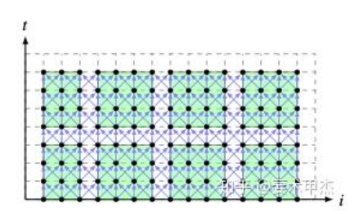
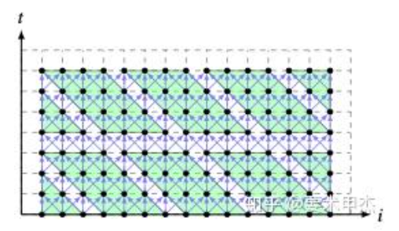
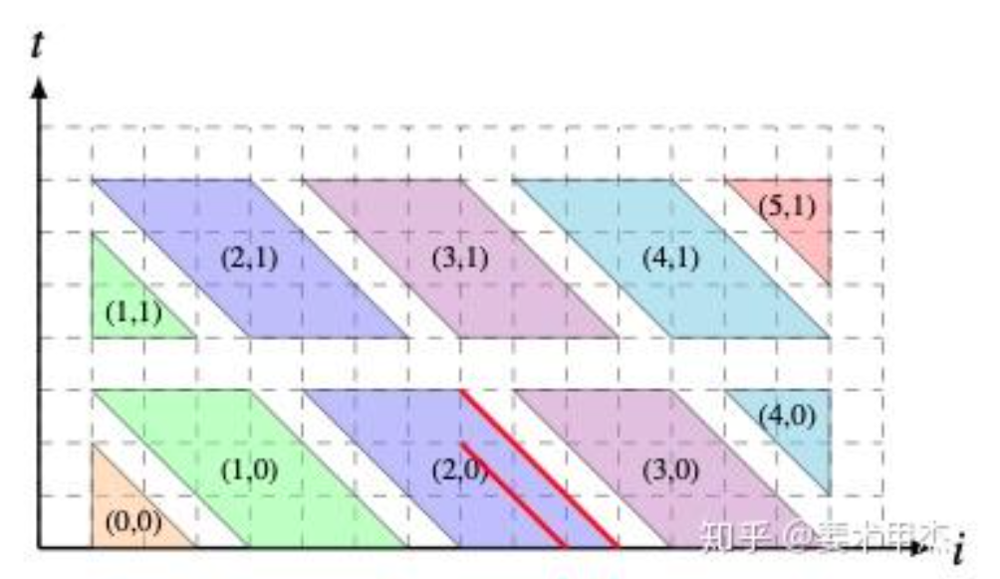
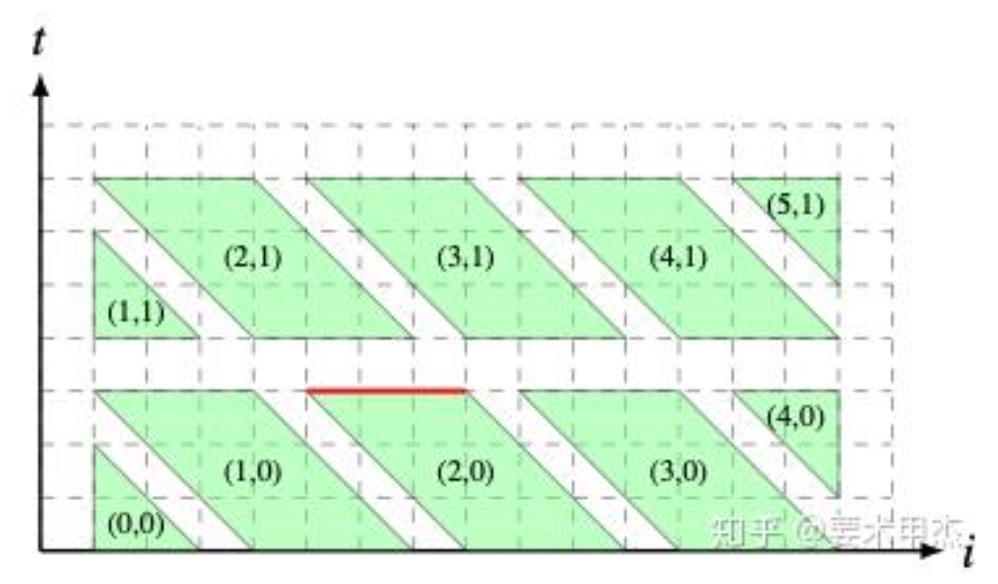

### 引子

我们先看一个例子。这个循环能否被并行化呢？

```c
for (int t = 0; t < N; t++) {
  for (int i = 0; i < M; i++)
    a[t + 1][i] = a[t][i - 1] + a[t][i] + a[t][i + 1];
}
```
注意到对于同一个 $t$ 而言，不同的 $i$ 的数据都不相互依赖，所以我们可以沿着 $i$ 轴并行：

```c
for (int t = 0; t < N; t++) {
  // Parallize
  for (int i = 0; i < M/3; i++)
    a[t + 1][i] = a[t][i - 1] + a[t][i] + a[t][i + 1];
  for (int i = M/3; i < 2*M/3; i++)
    a[t + 1][i] = a[t][i - 1] + a[t][i] + a[t][i + 1];
  for (int i = 2*M/3; i < M; i++)
    a[t + 1][i] = a[t][i - 1] + a[t][i] + a[t][i + 1];
}
```
然而，如果 `sizeof(a[i])` 很大，`a[t+1][i]` 可能就被 flush 掉了，无法在计算 `a[t+2][i]` 的时候重新使用。这样的数据局部性不是最好的。

为了提升局部性，我们也许可以考虑循环分块，但这是不可行的：



图源[知乎](https://zhuanlan.zhihu.com/p/199683290)

如果就这样分块，可以看到两个块之间是有循环依赖的。

但是，如果我们改写一下，令 $j = t + i$：
```c
for (int t = 0; t < N; t++) {
  for (int j = t; j < M + t; j++)
    a[t + 1][j - t] = a[t][j - t - 1] + a[i][j - t] + a[i][j - t + 1];
}
```
再沿着 $t$ 和 $j$ 分块（这里的 if 可以变为 min/max 放进循环条件中，但清晰起见，仍然保留）：
```c
for (int t = 0; t < N; t += B) {
  for (int j = t; j < t + M; j += B) {
    for (int T = t; T < t + B; T++) {
      for (int J = j; J < j + B; J++) {
        int i = J - T;
        if (i >= 0 && i < M)
           a[t + 1][j - t] = a[t][j - t - 1] + a[i][j - t] + a[i][j - t + 1];
      }
    }
  }
}
```

这样会得到如图所示的依赖关系：



（图源[知乎](https://zhuanlan.zhihu.com/p/199683290)）

这些分块之间是可以并行的，而且数据局部性有所提升。

问题来了：我们是怎么想到要进行变换 $j = t+i$ 的呢？能不能自动找到合适的变换，使得循环适合分块呢？

这就是多面体模型要解决的事情。

### 计算循环中的依赖

对于最初的那个循环，我们知道 $(i + 1, j)$ 依赖于 $(i, j - 1)$, $(i, j)$ 以及 $(i, j+1)$。在计算机中，我们该如何表示这三个依赖呢？

或许最直接的想法是存储它们的差值：三个向量，$(1, -1)$, $(1, 0)$ 和 $(1, 1)$。但这并不总是有效。考虑这样的循环：
```c
for (int i = 0; i < n; i++)
  for (int j = 0; j < n; j++)
    a[i][j] += a[j][i];
```
这样 $(i, j)$ 和 $(j, i)$ 之间不仅有数据依赖，还有反依赖 (WAR 依赖)。而且，仅仅使用向量是无法表示它们的差值的。我们需要更泛用的工具，能够处理更一般的循环，甚至包括那些不是 perfectly nested 的循环（例如下面这个矩阵乘法）。
```c
for (int i = 0; i < n; i++)
  for (int j = 0; j < n; j++) {
    S:  c[i][j] = 0;
    for (int k = 0; k < n; k++)
      R:  c[i][j] += a[i][k] * b[k][j];
  }
```

而且，还有一个难点：一个循环语句会被执行很多次。我们自然不能把每次执行的“同一条语句”当成是一样的，需要给它附加上“现在到底进行到哪”的信息。

好在循环变量本身就可以用来表示目前循环进行到的位置。我们以 $\vec{x}$ 来表示循环变量构成的向量，例如对语句 $S$ 而言，它的 $\vec{x}_S = (i, j)$，而对语句 $R$ 而言则有 $\vec{x}_R = (i, j, k)$。

循环变量是有界的整数。比如说：
```c
for (int i = 0; i < 2; i++)
  for (int j = 0; j < 2; j++)
    //...
```
我们自然可以用 4 个不等式来描述 $(i, j)$ 的取值范围：

$$\begin{align*}
i &\geq 0 \\ 
i &\leq 2 \\
j &\geq 0 \\
j &\leq 2 \\
\end{align*}$$

换言之：

$$\left(
\begin{matrix}
1 & 0 \\
-1& 0 \\
0 & 1 \\
0 & -1
\end{matrix}
\right)
\left(
\begin{matrix}
i \\ j
\end{matrix}
\right)
+
\left(
\begin{matrix}
0 \\ 2 \\ 0 \\ 2
\end{matrix}
\right)
\geq \vec{0}$$

类似这样的不等式组构成的一个集合被称作**多面体**。


设 $\mathbb{K}$ 是一个域。一个集合 $\mathcal{P}$ 如果满足 $\mathcal{P} = \{\vec{x} \in \mathbb{K}^m \mid A\vec{x} \leq \vec{b}\}$，它就是一个**多面体**。

若存在矩阵 $A\in\mathbb{K}^{m\times n}$ 与向量 $b\in \mathbb{K}^n$，使得函数 $\phi: \mathbb{K}^m \rightarrow \mathbb{K}^n$ 满足 $\phi(x) = A\vec{x}+\vec{b}$ ，那么$\phi$ 是**仿射变换**。

对于 1 维的仿射变换，也就是 $\phi(\vec{x}) = \vec{a}^T\vec{x} + b$，它构成一个**超平面**，而 $\vec{a}$ 就是它的法向量。自然地，它也可以定义一个**仿射半空间**：$\{\vec{x} \mid \phi(\vec{x}) < 0\}$。

显然，多面体就是有限个仿射半空间的交。如果某个超平面 $F$ 对应的仿射半空间包含整个多面体，那么这个超平面与多面体的交就是多面体的一个**面**。

对 ${} n$ 维的多面体，它 $n-1$ 维的面是一个**切面** (facet)。


现在我们有了数学工具来划定循环变量的范围。是时候来看看具体使用它们的语句了。

每条语句所访问的内存位置，是 $\vec{x}$ 的一个或者几个函数，不妨叫做 $f$。将这个语句所在的循环中，循环变量所有可能的取值称作 $\mathcal{D}$。（$\mathcal{D}$ 是一个**多面体**。）

比如语句 `c[i*2][j*3+1] = 0`，它所对应的 $f(\vec{x})$ 就是 $f((i, j)) = (2i, 3j+1)$。

我们只考虑 $f$ 是仿射变换的情况；这足够涵盖大多数的程序了。

给定一个深度为 $l$ 的循环，如果其中的语句 $R$ 依赖语句 $S$，那么我们有：

- 它们访问了同一个位置： $f_R(\vec{x}_R) = f_S(\vec{x}_S)$；
- 它们都在各自循环变量所允许的范围内：$\vec{x}_R\in \mathcal{D}_R$, $\vec{x}_S\in \mathcal{D}_S$；
- $R$ 在 $S$ 之后执行：$\vec{x}_R >_\mathrm{lex} \vec{x}_S$.

这三个条件都是仿射的，所以满足这三个条件的 $(\vec{x}_R, \vec{x}_S)$ 构成了一个**依赖多面体** $\mathcal{D}_{R, S}$。每两条语句之间都可以计算出数个依赖多面体（因为 $l$ 可以取不同的值）。这可以构成一张有向图：语句为点，依赖多面体为边。两点之间会有不止一条边。

**例子.**

考虑下列程序：
```c
for (int i = 0; i < n; i++)
  for (int j = 0; j < n; j++)
    S1: a[i][j] += c;
for (int k = 0; k < n; k++)
  for (int l = 0; l < n; l++)
    S2: b[k] += a[k][l];
```

在这里，$S_2$ 依赖 $S_1$ 和它本身。但是，$S_1$ 则并不依赖它本身。

计算一下 $S_1$ 和 $S_2$ 之间的依赖多面体。容易发现 $f_1(\vec{x}_1) = (i, j)$, 而 $f_2(\vec{x}_2) = (k, l)$.

- 它们访问了同一个位置：$(i,j)=(k,l)$;
- 它们都在各自循环变量所允许的范围内：$i,j,k,l\in [0,n)$;
- $S_2$ 在 $S_1$ 之后执行：这里的两个语句没有公共的循环，所以总是成立的。

我们可以把这六个约束写成矩阵：

$$\left(
\begin{matrix}
1 & 0 & 0 & 0 & 0 & 0 \\
0 &-1 & 0 & 0 & 1 &-1 \\
0 & 0 & 1 & 0 & 0 & 0 \\
0 & 0 & 0 & 1 & 1 &-1 \\
\hline
1 & 0 & 0 &-1 & 0 & 0 \\
0 & 1 &-1 & 0 & 0 & 0 \\
\end{matrix}
\right)
\left(
\begin{matrix}
i \\ j \\ k \\ l \\ N \\ 1
\end{matrix}
\right)
\begin{matrix}
\geq 0 \\
\geq 0 \\
\geq 0 \\
\geq 0 \\
= 0 \\
= 0 \\
\end{matrix}$$

这就是 $S_1$ 和 $S_2$ 间的依赖多面体（等号可以看成是两个小于等于）。

### Pluto 算法

在计算出依赖多面体之后，我们就可以开始考虑重排了。

Pluto 算法想要对程序中的所有语句进行重排，也就是为每一个语句的第一个下标都求出一组 1 维的仿射变换 $\{\phi_1, \dots, \phi_m\}$。假如语句 $i$ 用到的循环变量是 $(x_1, \dots, x_k)$, 变换后就成了 $(\phi_i(x_1, \dots, x_k), x_2, \dots, x_k)$. 接着，Pluto 算法会为第二个下标再求出一个新的仿射变换，以此类推。

别忘了我们最初的目的：计算出一个适合分块的重排方式。合法的重排需要满足重排后每个块的依赖关系构成一个全序。

我们采取 Pluto 算法[论文](https://dl.acm.org/doi/pdf/10.1145/1375581.1375595)中的记号设 $T$ 依赖 $S$，其中 $T$ 的循环变量所构成的向量是 $\vec{t}$，而 $S$ 的向量则是 $\vec{s}$。在上述有向图中，对 $T, S$ 之间的边 $e$，它的依赖多面体记作 $\mathcal{P}_e$ .

重排合法的必要条件是：

$$\forall (\vec{s}, \vec{t})\in \mathcal{P_e},\ \phi_t(\vec{t}) - \phi_s(\vec{s}) \geq 0$$

也就是 $\vec{s}$ 的每一维都在 $\vec{t}$ 之前被执行。

这个差值还有物理意义。注意到 $\phi(\vec{x})$ 可以看做是 $\vec{x}$ 离原点的距离，那么 $\phi_t(\vec{t}) - \phi_s(\vec{s})$ 就是两个平面之间的距离。它还代表着分块之间所需要交流的数据量。以最开头的那个循环为例，

```c
for (int t = 0; t < N; t++) {
  for (int i = 0; i < M; i++)
    a[t + 1][i] = a[t][i - 1] + a[t][i] + a[t][i + 1];
}
```
我们对它施加的变换是 $(t, i) \rightarrow (t, t+i)$, 也就是 $\phi_1(t, i) = t$, 而 $\phi_2(t, i) = t + i$. 像下图那样分块的话，$\phi_2(t) - \phi_2(s)\leq 2$，说明如果沿 $\phi_2 = (1, 1)$ 这个法向量分块，每个块中需要向其他块传递数据的只有两个超平面，也就是图中红色部分的标识。



（图源[知乎](https://zhuanlan.zhihu.com/p/199683290)）

同样地， $\phi_1(t) - \phi_1(s) \leq 1$，所以如果沿 $\phi_1 = (0, 1)$ 这个法向量分块，那么只需要传递 1 个超平面的数据：



（图源[知乎](https://zhuanlan.zhihu.com/p/199683290)）

所以，Pluto 算法的目标是：
- 找到满足条件 $\phi_t(\vec{t}) - \phi_s(\vec{s}) \geq 0$ 的仿射变换 $\phi$ ;
- 求解 $\phi$ 的系数，使得这个差值 $\delta_e(\vec{s}, \vec{t}) = \phi_t(\vec{t}) - \phi_s(\vec{s})$尽量小。

比如说对于二维的情况，我们有 $\delta_e(\vec{s}, \vec{t}) = c_1t_1 + c_2t_2 - c_3s_1 - c_4s_2$，而我们的目标是求出 $c_i$，使得它对在 $\mathcal{P}_e$ 里的 $(\vec{s}, \vec{t})$ 最小。

这并不是一个很好解决的数学问题，因为 $\mathcal{P}_e$ 的限制太奇形怪状了，难以利用。我们需要转化一下。

注意到，$\delta_e(\vec{s}, \vec{t})$ 必定存在一个仿射的上界 $\nu(\vec{p})$，其中 $\vec{p}$ 是程序的参数，例如上面例子中的 `N`。也就是说我们可以保证：

$$\nu (\vec{p}) - \delta_e(\vec{s}, \vec{t}) \geq 0$$

对于每一个在多面体 $\mathcal{P}_e$ 中的向量 $(\vec{s}, \vec{t})$ 都成立，而且不等式左边是仿射的。

所以，我们可以利用 Farkas 引理。

##### Farkas 引理

设 $A\in \mathbb{R}^{m\times n}$, $\vec b\in \mathbb{R}^m$. 那么下列两项中恰有一项成立：
- 存在 $\vec x\in \mathbb{R}^n$, 使得 $\vec{x} \geq 0$ 且 $A\vec{x} = \vec{b}$;
- 存在 $\vec{y}\in \mathbb{R}^m$, 使得 $A^T\vec{y} \geq 0$ 且 ${} \vec{b}\cdot \vec{y} < 0$.

我们不给出严谨的证明，但我们可以直观地理解它：

想象 $A$ 的列向量构成的锥。我们知道 $A\vec{x}=\vec{b}$ 其实就是说 $\vec{b}$ 是 $A$ 列向量的线性组合。如果存在一个正的 $\vec{x}$，意味着 $\vec{b}$ 在这个锥内；否则，一定存在一个平面能将这个锥和 $\vec{b}$ 隔开，而这个平面的法向量就是 $\vec{y}$。

**Farkas 引理的仿射形式.**

对于 $n$ 维凸多面体 $\mathcal{P}_e = \{\vec{x} \mid A\vec{x} + \vec{b} \geq 0\}$, 若仿射函数 $\phi: \mathbb{R}^n \rightarrow \mathbb{R}$ 满足 $\phi(\vec{x}) \geq 0$ 在 $\mathcal{P}_e$ 内恒成立，那么存在非负的 $\lambda_0$ 和非负的 $n$ 维向量 $\vec \lambda$ 使得：

$$\phi(\vec{x}) = \vec \lambda \cdot (A\vec{x}+\vec{b}) + \lambda_0$$

我们可以通过给 $\vec{x}$ 的末尾塞一个 1 的方式来去除常数项，所以只考虑 $\mathcal{P}_e = \{\vec{x} \mid A\vec{x} \geq 0\}$ 以及 $\phi(\vec{x}) = \vec{c} \cdot \vec{x}$ 的情况。

假设 $\vec{y}\in \mathcal{P}_e$ , 那么 $A\vec{y} \geq 0$ 和 $\vec{c}\cdot \vec{y} < 0$ 无法同时成立。根据 Farkas 引理，必然存在 $\vec{\lambda}\in \mathbb{R}^n$, 使得 $\vec{\lambda} \geq 0$ 而且 $A^T\vec{\lambda} = \vec{c}$. 

所以 $\phi(\vec{x}) = \vec{c}^T\vec{x} = \lambda^T A\vec{x}$.


回到我们之前的目标。我们有：对所有的 $(\vec{s}, \vec{t})\in \mathcal{P}_e$，

$$\nu (\vec{p}) - \delta_e(\vec{s}, \vec{t}) \geq 0$$

这符合 Farkas 引理的应用条件。所以，

$$\nu (\vec{p}) - \delta_e(\vec{s}, \vec{t}) = \lambda_0 + \sum_{k=1}^n \lambda_k \mathcal{P}_e^k$$

其中 $\mathcal{P}_e^k$ 是第 $k$ 个面。


现在左右都是循环变量乘以系数的结构。根据待定系数法，我们可以得到 $\phi$, $\nu$ 的系数与 $\vec{\lambda}$ 的**线性**关系，而我们可以通过 Fourier-Motzkin 消去法去除 $\vec \lambda$ 这些参数，只留下 $\phi$ 的系数 ${} \vec {c}_\phi {}$ 以及 $\nu(\vec{p}) = \vec{u}\cdot \vec{p} + w$ 中的参数 $\vec{u}$ 和 $w$。接下来，我们只需要最小化上界 $\nu(\vec{p})$ 就好了。

容易发现 $u_i\neq 0$ 就意味着这层循环无法并行化。我们自然希望优先并行化外层循环，所以我们想要求出满足上述线性方程组和不等式的，**字典序最小**的 $(\vec{u}, w, \vec{c}_\phi)$.

这就是 Pluto 算法求解第一维仿射变换的系数的过程。


我们来看一个例子。

```c
for (int i = 1; i <= N; i++)
  for (int j = 2; j <= N; j++)
    a[i][j] = a[j][i] + a[i][j - 1];
```
我们需要先计算出语句间的依赖多面体 $\mathcal{P}_e$ .

第一种情况：**真依赖**，也就是 `a[i][j-1]` 的读取依赖`a[i'][j']` 的写入。那么：
- 访问同一个位置： $(i, j - 1) = (i', j')$;
- 在循环范围内：$i, i'\in [1, N]$, $j, j'\in [2, N]$;
- $(i, j)$ 在 $(i', j')$ 之后执行，总是满足。

还有一个真依赖：`a[j][i]` 的读取依赖 `a[i'][j']` 的写入。那么：
- 访问同一个位置：$(j, i) = (j', i')$;
- 在循环范围内：$i, i'\in [1, N], j, j'\in [2, N]$;
- ${} (i, j) {}$ 在 $(i', j')$ 后执行：$(i, j) >_\mathrm{lex} (i', j')$, 也就是 $i > i'$ 或 $i = i', j > j'$. 后一种是不可能的。

第二种情况：**反依赖**，也就是 `a[i][j]` 的写入依赖于 `a[j'][i']` 的读取。那么：
- 访问同一个位置：$(j', i') = (i, j)$;
- 在循环范围内：$i, i'\in [1, N]$, $j, j'\in [2, N]$;
- $(i, j)$ 在 ${} (i', j') {}$ 后执行：$(i, j) >_\mathrm{lex} (j', i')$, 也就是 $i > i'$ 或 $i = i', j > j'$. 后一种是不可能的。

这里没有输出依赖。

总而言之，我们有三个依赖多面体，每一个都指明了 $i, j$ 的取值范围。需要分别对它们应用 Pluto 算法得到 $\phi(\vec{t})$ 系数的约束条件，然后取这些约束条件的交。


先看第一个多面体。设 $\phi(i, j) = c_1i + c_2j$, 那么我们有 $c_1i + c_2j - (c_1i + c_2(j-1)) \geq 0$, 所以 $c_2 \geq 0$.
此外，我们还有 $\nu(p) = u N + w \geq c_2$，也就是 $c_2 \leq w$. 

再看第二个。这里的约束条件是 $(c_1i + c_2j) - (c_1j + c_2i) \geq 0$, 其中 $i\in [1, N], j\in [2, N]$ 而且 $i - j \geq 1$. 换言之，这就是 $c_1 \geq c_2$.

下面我们需要对 $\nu(p) - \delta_e(\vec{s}, \vec{t})$ 应用 Farkas 引理，因为这出现了 $\phi$ 的系数和循环变量相乘的情况。我们的多面体 $\mathcal{P}_e$ 的五个切面分别是

$$\begin{align*}
i - 1 &\geq 0 \\
j - 2 &\geq 0 \\
N - j &\geq 0 \\
N - i &\geq 0 \\
i - j - 1 &\geq 0
\end{align*}$$

所以，

$$uN + w - (c_1 - c_2)(i - j) = \lambda_0 + \lambda_1 (i - 1) + \lambda_2 (j - 2) + \lambda_3(N - j) + \lambda_4 (N - i) + \lambda_5 (i - j - 1)$$

比对系数：

$$\begin{align*}
u &= \lambda_3 +\lambda_4 \\
w &= \lambda_0 - \lambda_1 - 2\lambda_2 - \lambda_5 \\
c_1 - c_2 &= \lambda_1 - \lambda_4 + \lambda_5 \\
c_2 - c_1 &= \lambda_2 - \lambda_3 - \lambda_5
\end{align*}$$

我们还有六个约束 $\lambda_i \geq 0$. 现在我们想要求出的是 $u, w, c_1$ 和 $c_2$ 的范围。

如上所述，我们使用高斯消元法处理等式，而用 Fourier-Motzkin 消去法处理不等式。FM 的基本使用方式是，将一个变量单独分离到不等式一边，把所有约束都写成 $x \leq A_i$ 或者 $x \geq B_j$ 的形式。然后两两组合，得到 $i\times j$ 个约束 $B_j \leq A_i$.

我们先处理等式，四个等式可以消除四个 $\lambda_i$. 我们不妨留下 $\lambda_3$ 和 $\lambda_5$ 作为变量，将另外四个 $\lambda$ 用它们和 $u, w, c_1, c_2$ 表示。

具体过程略去。我们有：

$$\begin{align*}
\lambda_0 &= c_2 - c_1 + u + \lambda_5 \geq 0 \\
\lambda_1 &= c_1 - c_2 + u - \lambda_3 - \lambda_5 \geq 0\\
\lambda_2 &= c_2 - c_1 + \lambda_3 + \lambda_5 \geq 0\\
\lambda_3 &\geq 0 \\
\lambda_4 &= u - \lambda_3 \geq 0 \\
\lambda_5 &\geq 0
\end{align*}$$

接着，消去 $\lambda_3$ 和 $\lambda_5$. 先看 $\lambda_3$. 它“大于”的约束有两个：$\lambda_3 \geq 0$;  $\lambda_3 \geq c_1 - c_2 + \lambda_5$.
它“小于”的约束也有两个：$\lambda_3 \leq u$, $\lambda_3 \leq c_1 - c_2 + u - \lambda_5$.

将它们交错，我们得到四个新的约束：

$$\begin{align*}
0 &\leq u \\
0 &\leq c_1 - c_2 + u - \lambda_5 \\
c_1 - c_2 + \lambda_5 &\leq u \\
c_1 - c_2 + \lambda_5 &\leq c_1 - c_2 + u - \lambda_5
\end{align*}$$

最后一个约束实际上重复了。

原来 $\lambda_3$ 的约束都用过了，我们可以丢掉含有 $\lambda_3$ 的式子。接下来我们消去 $\lambda_5$, 可以得到 $c_1 - c_2 \leq u$. （有一个式子重复了。）


对于第三个约束，我们直接给出结果：$3u + w - c_1 - c_2 \geq 0$, 而且 $u \geq 0$.

注意到我们求出的五个约束有一组平凡解: $(u, w, c_1, c_2) = (0, 0, 0, 0)$. 这没有意义。为了避免这个解，Pluto 算法选择了舍弃大量的可能解，加入了一个强力的约束条件：

对于所有 $\phi$ 的系数 $c_i$, 要求 $c_i \geq 0$ 而且 $\sum c_i \geq 1$.

在这里，就是再加上三个不等式：$c_1 \geq 0$, $c_2 \geq 0$ 以及 $c_1 + c_2 \geq 1$.

现在我们有了七个不等式（$c_2 \geq 0$ 重复了）。别忘了我们需要求出 $(u, w, c_1, c_2)$ 字典序最小的解。手动计算一下就可以得知是 $(0, 1, 1, 1)$, 也就意味着我们需要将循环的第一维改写成 $i + j$，而且以 $(1, 1)$ 为法向量分块的话，至多只需要在 1 个超平面间传输数据。

这就是 Pluto 的工作原理。
