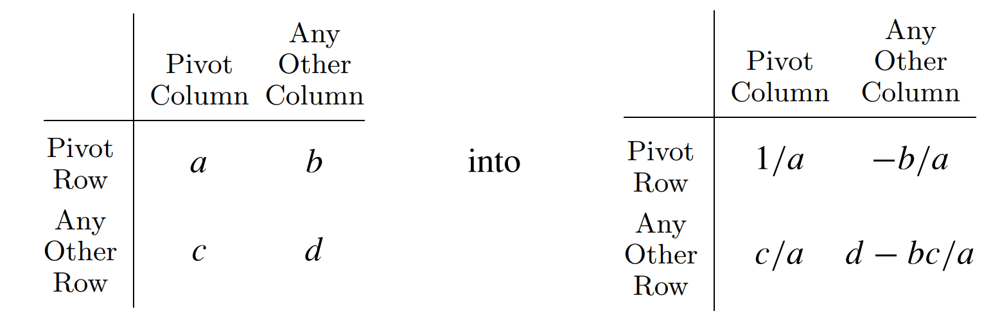

# 带参数的单纯形法

这篇文章基于 Detlefs et al., 2005, *Simplify: A Theorem Prover for Program Checking* ([见此链接](https://dl.acm.org/doi/pdf/10.1145/1066100.1066102)), 由它整理补充而成. 后文中, 我们会以 Simplify 来指代它.

在[单纯形法](./simplex.md)中, 我们求解了满足 $A\mathbf{x}\leq \mathbf{b}$ 的所有的正向量 $\mathbf{x}$ 中, $\mathbf{c}^T\mathbf{x}$ 的最大值. 然而, 这里的 $A$, $\mathbf{b}$ 和 $\mathbf{c}$ 都是已知的常数. 如果约束中含有位置的参数, 我们能求解什么样的问题呢?

当然, 这时我们不知道各个参数的大小, 自然不会去求解某个 $\mathbf{c}^T\mathbf{x}$ 的最大值. 我们更关注的问题是: 这些约束有可能被满足吗? 如果有的话, 能不能找到一个具体的解呢?

## 单纯形表

在单纯形法中, 我们提及了这样的一个矩阵:

$$
\left[
\begin{array}{cc|c}
  A & I & b \\
  -c^T & 0 & 0
\end{array}
\right]
$$

我们通过对它执行矩阵行变换完成基的替入与替出, 从而逐步接近最优解. 这种矩阵叫做**单纯形表** (*simplex tableau*).

在带有参数的问题中, 我们也可以采用类似的单纯形表, 不过它会和普通的线性规划问题所使用的不太一样.

假设我们有一些不小于零的变量 (**受限**变量, *restricted unknown*), 还有一些可以任意取值的变量. 我们开始还有一些形如 $A\mathbf{y} = B\mathbf{x} + \mathbf{c}$ 的约束, 其中 $\mathbf{x}$, $\mathbf{y}$ 都是变量构成的向量.

我们把单纯形表写成这样:

$$
\left[
\begin{array}{c|cccc}
    & 1 & x_1 & \dots & x_m \\
\hline
y_0 & a_{00} & a_{01} & \dots & a_{0m} \\
\dots & & & & \\
y_n & a_{n0} & a_{n1} & \dots & a_{nm}
\end{array}
\right]
$$

这里每一行都表示一个等式约束, 例如第一行就是 $y_0 = a_{00} + a_{01}x_1 + \dots + a_{0m}x_m$. 仿照 Simplify 的记号, 我们给受限变量的右上角打上 $\geq$ 标记, 因为它们必须大于等于零.

我们称变量 $x_i$ **拥有** (*own*) 第 $i$ 列, 而变量 $y_j$ **拥有**第 $j$ 行. 我们认为第 0 行总是 0: $y_0$ 恒等于 0, 而其后的所有系数 $a_{0i}$ 也都等于零.

我们还规定了存在一些**死列** (*dead column*, `dcol`): $x_1$ 至 $x_{dcol}$ (均包含) 全部都等于零. 最初, `dcol = 0`. 注意, 第 0 列表示常数, 所以不在死列的范围之内; 在单纯形表中, 拥有它的也是常数 1.

如果 $y_i$ 所拥有的行中, 所有非零的值 $a_{ij}$ 都是负的, 而且 $x_j$ 受限 (也就是必须非负), 那么 $y_i$ 是**明显最大** (*manifestly maximized*) 的; 如果 $y_i$ 所拥有的行中, 所有负值 $a_{ij}$ 对应的 $x_j$ 都不受限, 那么 $y_i$ 是**明显无界** (*manifestly unbounded*) 的, 它可以取任意大的值. 这确实十分明显, 只需要回顾我们对每一行所代表的约束的定义就可以了.

我们来画一个单纯形表. 假设我们有如下的约束条件:

$$
\begin{align*}
a_1 - a_2 + 2a_3 &= a_4 \\
-a_1 - 3a_2 + 1 &= a_5 \\
a_1, a_2, a_4 &\geq 0
\end{align*}
$$

那么它的单纯形表如下:

$$
\left[
\begin{array}{c|cccc}
    & 1 & a_1^\geq & a_2^\geq & a_3 \\
\hline
zero & 0 & 0 & 0 & 0 \\
a_4^\geq & 0 & 1 & -1 & 2 \\
a_5 & 1 & -1 & -3 & 0
\end{array}
\right]
$$

其实, 行和列的选择是任意的, 但显然将 $a_4$ 和 $a_5$ 放在行那里会方便很多. 我们还插入了一个 `zero` 变量, 它恒等于零. 这时, 我们刚刚初始化, 所以 `dcol = 0`.

这些变量中, 有一些是未知但确定的参数, 而有些则是可以变动的. 现在, 我们的问题是: 给定这些参数, 是否能够为那些可以变动的变量找到一个值, 使得所有的约束条件都被满足?

## 寻找样本点

显然, 如果我们给所有列的主人 $x_i$ 都赋值为 0, 那么行的主人 $y_i$ 就应当等于第 0 列的常数 $a_{i0}$. 这满足了所有的等式, 还满足了**死列**的要求. 如果 $a_{i0}$ 再满足符号要求, 我们就找到了一个**样本点** (*sample point*), 解决了我们关心的问题.

接下来, 我们就要进行一系列变换, 试图令 $a_{i0}$ 满足符号要求, 或者判断目前已经不可能满足.

在单纯形法中, 我们换基; 在这里, 我们不再有基解的概念, 不过每一行的主人和基解依然十分类似: 现在"行"的主人一般非零, 而列的主人则是零, 这正像是基解一般非零, 而非基变量都为零. 所以, 仿照普通的单纯形法, 我们可以将一个行的主人和一个列的主人互换, 同时保持约束条件. 不过, 我们要求那一列不是死的.

容易检验, 这张图描述的变换就可以做到这一点 (来自 Simplify 原文):



在这种情况下, 我们就获得了检验一个变量的最大值的符号的方法: 把它换到行上, 然后不断选择一对行列变量交换, 直到这一行只有非正的值为止. (需要全部为非正值, 是因为上面我们讲过的**明显最大**和**明显无界**的条件.) 这也就相当于单纯形法中求解最大值时, 不断换基使得 $\mathbf{c}^T\mathbf{x}$ 中 $\mathbf{c}$ 的系数全部非正的操作. 下面我们来看看如何选择用以交换的变量.

假设我们想让第 $i$ 行的所有值都非正. 首先, 我们确定换入的列. 第 $j$ 列的主人原本是零, 而在换入之后, 它很可能会变得非零. 假设换完之后, 它的值变成了 $x_j$, 那么第 $i$ 行的主人 $y_i$ 就会增加 $a_{ij}x_j$. 显然我们必须要求 $a_{ij}\neq 0$, 不然 $y_i$ 不会有任何变化; 此外, 如果 $x_j$ 受限, 那么 $a_{ij}$ 也必须是正的, 因为我们希望让 $y_i$ 持续增加. 如果已经没有满足这些条件的 $x_j$, 我们就无法进行变换.

接下来我们确定换出的行. 不妨考虑第 $k$ 行, 那么目前第 $k$ 行主人 $y_k$ 的值实际上是 $a_{k0}$ (来自只含有常数的第 0 列). 换出后, 它将会变为 0, 所以 $x_j$ 必须减少 $a_{k0} / a_{kj}$ 才能满足那一行的约束, 这将导致 $y_i$ 减少 $a_{ij}a_{k0}/a_{kj}$. 我们需要保证 $y_i$ 在增加而不是减少, 所以 $a_{ij}a_{kj}$ 必须小于零. 不过, 和普通的单纯形法不同, 我们在这里取所有受限 $k$ 中, $a_{k0} / a_{kj}$ 最小的那个 (而不是最大的), 这是为了保证变换后所有受限的 $k$ 依然是非负的.

我们还需要考虑一个特殊情况: 行的主人没有任何一个是受限变量. 这时, $y_i$ 是无界的. 实际上, 如果选择第 $i$ 行换出, 可以立即把这一行变为明显无界的形式.

那么, 我们可以给出上述流程的伪代码:

```js
// Find pivot to maximize the i-th row.
// Returns the column and row chosen for pivot.
function find_pivot(i: number): [number, number] {
  // Choose a pivot column. We only consider live columns.
  let live = range(dcol + 1, column_count);
  let unrestricted = live.filter(j => !restricted(j) && a[i][j]);
  let j = unrestricted[0];
  if (!j) {
    let restricted = live.filter(j => a[i][j] >= 0);
    j = restricted[0];
  }
  if (!j)
    // No pivot available.
    return [ -1, -1 ];

  // Now choose a pivot row.
  let rows = range(0, row_count);
  // The row must be restricted and will cause a increase to `y_i`,
  // hence the `a[i][j] * a[k][j] < 0`.
  let candidates = rows.filter((k) => {
    return restricted(k) && a[i][j] * a[k][j] < 0 && k != i
  });
  // No restriction, unbounded.
  if (!candidates.length)
    return [ j, i ];

  // Choose the most restricted row as pivot.
  let k = argmin(candidates.map(k => a[k][0] / a[k][i]));
  return [ j, k ];
}
```

(TBC)

**我是 [AdUhTkJm](https://github.com/AdUhTkJm). 文中如有错漏, 请在 [Issues](https://github.com/GirlsBandCompiler/Tutorials/issues) 中指出.**
