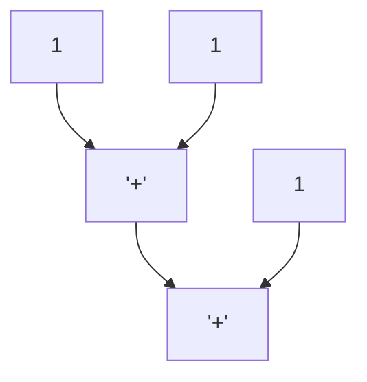

# 编译器结构概览

要学会写编译器，首先从了解编译器由哪些部分构成，明白编译的大体流程开始。

> [!NOTE]  
> 本文中有一些术语的中文翻译可能并不准确，以英文为准

# 编译器是怎么实现的？

从宏观上，我个人喜欢这么解释：

编程语言中的 _语义_ 指的是程序代码所表示的实际意义、操作和行为，而编程语言 **编译** 的实质就是建立语义模型和一系列的 “保语义变换”。

其中：

- **建立语义模型**: 分析源代码，提取出语义信息，并创建相应的数据结构存储它们。

- **保语义变换**: 在不改变程序含义的前提下，对数据结构进行一系列转换，包括代码优化和机器码生成。

根据这两个定义，我们可以将负责建立语义模型的程序称为编译器的前端，而负责实行保语义转换的程序则称之为编译器的后端。

## 编译器前端：负责从源代码提取信息，建立语义模型

前端的每个阶段都在分析源代码中的语义，向建立的数据结构中补充信息，直到形成一个完整的用于分析的语义模型。

它通常包括以下几个阶段：

1. **预处理**：对源代码进行预处理。

2. **词法分析**：将源代码转换为单词流。

3. **语法分析**：将单词流转换为语法树。

4. **语义分析**：在语法树上标注类型、符号等信息，并进行语义检查。

5. **中间代码生成**：将标注过的语法树转换为中间表示。

### 预处理（Preprocessing）

预处理即是对源代码进行预处理，比如 C 语言的预处理器在识别到宏定义 `#define foobar (1 + 1)` 后会将后续的 `foobar` 展开为 `(1 + 1)`。如果不太明白，可以简单地认为它就是单纯的文本替换。

预处理不是编译器的必备功能，但一些编译器包含它。预处理阶段通常是在词法分析和语法分析之前进行的，这个阶段的工作通常包括宏展开、头文件包含等。可以认为，这些将宏展开为具体值的操作也属于“补全语义信息”。

### 词法分析（Lexical Analysis）与 语法分析（Syntax Analysis）

词法分析与语法分析的作用都是解析源代码的结构。以往也有直接从一大块文本直接分析代码结构的做法，但这样的做法会导致代码不利于理解和维护，因此现在通常分这两个阶段解析源文件。

词法分析遵从词法，语法分析遵从语法。两者合称 编程语言的**文法**，通常用 BNF（巴科斯-诺尔范式）来形式化地描述。

#### **词法分析**

词法分析按一定的规则将一整块的源代码文本切割为关键字、数字字面量、运算符等种类的单元。拿 `1 + 1` 举例，它可能被词法分析切分为 `数字(1), 运算符(+), 数字(1)`。这些切割出来的单元就像句子里的单词，而在编译器中我们通常将这些单元称作 **词（Token）**，切割词的规则就是所谓的词法。在词法分析中，无意义字符（如空格、制表符、换行符等）一般会被跳过，因为它们对词法结构没有影响。

词法分析将字符流转化为 **词流（Token Stream）**。词流是一个关于词的有序集合，包含了从源代码切分出来的所有词。词流可以极大简化后续语法分析的实现方法。

#### **语法分析**

词法分析的下一步就是语法分析。语法分析按一定规则在词流上建立层次关系，例如 `1 + 1 + 1` 可层次化为 `加(加(数字(1), 数字(1)), 数字(1))`。

语法分析的结果是 **语法树（Syntax Tree）**，也是层次关系最直接的体现。通常语法分析会省略一些在后续分析中无意义的符号，比如 `{` `}` 这几个单词用于划定边界之后就可以丢弃了，因为这些词对程序所要表达的意思（语义）无关紧要。省略了无意义符号，只保留带语义单词的语法树称为 **抽象语法树（Abstract Syntax Tree）**，例如上图所示。

### **语义分析（Semantic Analysis）**

语义分析包含语义标注和语义检查，它们经常交替进行。

语义标注是根据一定的规则，从语法树中推断出类型、符号等信息，然后标注到语法树的节点上以供后续分析使用。例如从 `1` 的类型为 `int` 推断出 `1 + 1` 的类型也是 `int`，并将这一信息标注到语法树上。再例如根据 `int a` 创建变量 `a` 的符号信息，并解算出同一作用域下 `a + 1` 中的 `a` 指向的是变量 `a` 的符号。

语义检查则是验证这些信息表达的语义是否合理。例如 `int a = "b"` 符合语法，但是在经过标注后，发现变量的类型是 `int`，而初始化表达式的类型是 `string`，此时就检查出语义错误。

语义分析的结果是一个标注并检查过的语法树。完成这一步时，通常表示程序具有合法的语义，且这些语义信息已经被解析完毕，存储到语法树中，可以进行下一步的分析、优化，或者直接生成目标代码。

### 中间表示生成（Intermediate Representation Generation）

编译器分为前后端，前端在结束工作之后需要向后端回报结果，而前端用于向后端传递信息的数据结构就是 **中间表示（Intermediate Representation, IR）**, 即在中间的表示程序语义的结构。

中间表示要用什么形状的数据结构表示，并没有定论。列表、树、图，或是多种结构的组合等都可以。但由于机器码一般都是线性的，现在大部分编译器至少使用了一种线性结构的中间表示来表示一串指令。有些编译器还会在外面套一层图来表示控制流、数据流等等。也有的编译器没有线性结构中间表示，而是全部都用图的节点来表示。

就线性结构的中间表示而言，最常见的有 **三地址码（Three Address Code, TAC）** 和 **静态单赋值形式（Static Single Assignment Form, SSA）**。SSA 形式常常被以 **基本块（Basic Block）** 为单位组织，整体组成一张 **控制流图（Control Flow Graph, CFG）**，CFG 利用数学中图的表示方式，标示计算机程序执行过程中所经过的所有路径。三地址码被 “龙书” 用于教学使用，静态单赋值形式代码被 LLVM、Go、JVM C1 等等编译器使用。整体使用图结构的中间表示有 **节点海（Sea of Nodes, SoN）** 等等。SoN 被 JavaScript V8、Graal JIT 等等编译器使用。目前来说，静态单赋值形式由于利于分析、优化，是比较流行的一种的中间表示。

此外，中间表示的具体设计是编译器设计中的一个重要课题，通常需要考虑到后端的实现、目标平台的特性、编译器的可扩展性等。

---

### 编译器后端：负责优化中间表示，并最终生成目标代码

后端的每个阶段都在**对中间表示进行分析和等价转换**。

它通常包括以下几个阶段：

#### **编译优化（Optimization）**

编译优化就是在**保持语义不变**的情况下，对程序运行速度、程序可执行文件大小作出改进。

通常来说，一个计算可能有多种等价的方式，而其中有一些方式比另一些方式在计算机上运行更高效，因此可以通过选择更优的方式来提高性能，这就是编译优化的原理。编译优化的种类繁多，没有一个固定的模式，但大部分都可以总结为**在某种分析提供的信息的保证下，发现等价且更优的计算方式**。
下面举一些例子说明如何在不改变程序运行结果的前提下使程序更高效：

① `1 + 1` 可以被优化为 `2`，称为"常量折叠"。它将编译时就可以确定的表达式直接计算出结果，而不必在程序运行时计算。

② `a * 2` 可以被优化为 `a + a`，称为"运算强度削弱"。在大部分机器上乘法的开销都比加法大，这种替换是等价且更优的。 

为以上两种优化提供等价性证明的是数学原理，我们不需要进行显式分析。

③ `b = a + 1; c = a + 1;` 可以被优化为 `b = a + 1; c = b;`，称为公共子表达式消除。它识别出重复的计算，改为只计算一次，然后将结果保存起来供后续使用。

而为了证明优化前后的程序语义是等价的，我们就要进行一些分析，比如比较表达式的相等性等。

此外，编译优化还分为 **平台无关优化** 和 **平台相关优化**。前者是针对所有平台的通用优化，后者是针对特定平台的优化。这是由于各种平台的指令集、寄存器等特性不同，每个平台都可能有一些特有的优化，可以用于进一步榨取性能。

编译优化是编译器中 **最重要、最复杂** 的部分之一，一款工业级编译器的绝大部分工作量都在于实现各种编译优化。

#### **目标代码生成（Target Code Generation）**

目标代码生成就是将上一步优化后的中间表示转换为目标代码（一般是机器码），因为中间表示通常是用于分析，而不是直接执行的。

目标代码生成的过程通常包括以下几个步骤：

① **指令选择（Instruction Selection）**: 根据中间表示选择合适的机器指令。

在这一步中，编译器会用指令集中具体的机器指令来实现中间表示中指令的语义，这通常使用宏展开、树覆盖、有向图覆盖等算法来实现。

在指令选择中也会伴随有一些微小的优化。如在 x86 平台上，`lea` 指令可以替代 `mul` 做特定系数的乘法运算。再比如要清零 `eax` 寄存器，使用 `xor eax, eax` 比 `mov eax, 0` 能节省 3 个字节的长度。

② **指令调度（Instruction Scheduling）**: 对指令进行排序，以提高执行效率。

在这一步中，编译器会尝试静态调度各个指令的执行顺序，来最大化利用各项资源。编译器会分析指令之间的数据依赖，找出可以调换顺序而不影响执行结果的指令，重新排列其执行顺序，以降低指令流水之间的暂停、减少寄存器的使用压力等等。

③ **寄存器分配（Register Allocation）**:将变量分配到寄存器中，以提高访问速度。

由于寄存器的访问速度是最快的，且在某些指令集中，寄存器可做的运算比内存可做的运算多，因此编译器需要最大化寄存器的利用率以提高程序性能。

编译器会进行 **活跃变量分析（Variable Liveness Analysis）**，在程序运行的每个时间点找到正在参与运算的变量，尽可能分配到寄存器中，使运算效率最高。当参与运算的变量多于寄存器时，就只能将一些变量存储到内存中。

寄存器分配的主流算法是 **图着色算法（Graph Coloring）** 和 **线性扫描算法（Linear Scanning）**，一般来说，图着色的复杂度高于线性扫描，分配效果略好一些。但近年来，线性扫描算法也有了长足的进步。还有一些较为简单的方法，比如 栈顶缓存 和 给变量分配固定的寄存器，当然也可以 完全不分配！（逃

在目标代码生成完成后，编译器就可以输出最终的目标文件了。

---

**以上！MikanAffine 敬上！**
